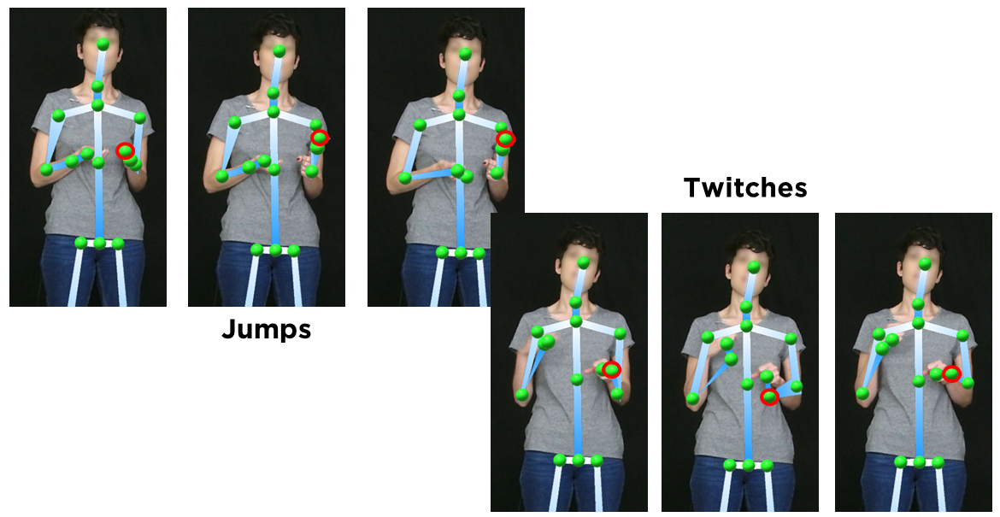

Jitter correction
=================

This page describes in detail the algorithm used for the jitter correction in the function
:meth:`~krajjat.classes.sequence.Sequence.correct_jitter`.

Informal definition
-------------------
De-jittering in Krajjat allows to correct two types of artifacts via interpolation: **jumps** and **twitches**:

  * **Jumps** are defined as brutal movements that need to be smoothed. Generally, they happen when the joint moved
    between two positions over the course of several frames, but only the starting and final positions were tracked.
  * **Twitches** are defined as short, fast artifact movements that need to be deleted. They are due to wrongful
    detections from the tracking system.

Below, you can see an image representing both artifacts.

Both jumps and twitches are defined based on:

  * A **velocity threshold**, defined in meters per second.
  * A **window**, defined either in number of poses or in seconds.

The algorithm detects, for each pair of consecutive frames, if the movement of a joint is over the threshold. If it is
the case, the algorithm then checks every subsequent frame in the window.

  * If the joint position comes back to a position that would be within threshold, the movement is categorized as a
    **twitch**.
  * In the other case, if the joint position does not come back within threshold after the n frames of the window, the
    movement is categorized as a **jump**.

In both cases, the position of the joint in the intermediate frames of the jump or twitch is corrected, interpolating
the true position using one of the interpolation methods of the
`scipy interp1d function <https://docs.scipy.org/doc/scipy/reference/generated/scipy.interpolate.interp1d.html>`_ (e.g.,
the interpolation can be linear, cubic, quadratic - see the documentation to see all the available methods).

.. note::
    This function was originally developed to be able to work with recordings with a variable framerate, making it
    suitable for recordings with both variable and constant framerates. As such, the function allows for a window size
    that can be defined in both number of poses or in seconds.

Formal definition
-----------------
Let’s call :math:`j_{t_p}` a joint, as being a 3-dimensional (x, y, and z, in cm to the origin) point being located in
space at a moment :math:`t_p` (in seconds), where p iterates through all the poses of a video. For a speed threshold
:math:`s` and a window :math:`w`, if the following inequation is true:
:math:`\displaystyle\frac{\sqrt{(x_{j_{t_{p+i}}}-x_{j_{t_p}})^2+(y_{j_{t_{p+i}}}-y_{j_{t_p}})^2+(z_{j_{t_{p+i}}}-z_{j_{t_p }})^2}}{{t_{p+1}-t_p}} ≥ s`
for :math:`i ∈ [1,w]` and :math:`i ∈ \mathbb{N}`,
the misplacement is considered as a jump.
If for any :math:`i ∈ [0,w]`, this inequation is false, the misplacement is considered as a twitch.

Example
-------
Let's consider a recording sampled at 8 Hz. We run the jitter correction algorithm with the following parameters:

  * Velocity threshold: **1 m/s**
  * Window: **0.5 s**

Given these parameters, the movement threshold between two frames will be 1/8 = 0.125 m. If between two frames, a joint
moves more than 0.125 m, the algorithm will try to perform a correction.

On frame 42, the algorithm detects that the joint ``HandRight`` moved 0.141 m compared to frame 41. As this is above
our threshold of 0.125, the algorithm will then check the subsequent frames.

Our window is 0.5 second - as our recording is sampled at 4 Hz, that means that our window contains 4 frames. The
algorithm will them check every frame up to frame 46.

For every frame, the algorithm checks if the position of the joint comes back within 0.125 m around the position of the
joint on frame 42. If it does, for example on frame 44, the algorithm skips the checking of frames 45 an 46, and the
artifact is categorized as a twitch. The position of the joint on frame 43 is corrected, based on the position at frames
42 and 44. If the position of the joint does not come back within the threshold before frame 46, the artifact is
categorized as a jump. The position of the joint on frames 43 to 45 is corrected, based on the position at frames 42 and
46.

Notes
-----
* The correction part is the same between a jump and a twitch, meaning that any movement over threshold will
  lead to a correction. However, the length of the window will define whether a movement over threshold is a twitch or a
  jump, i.e., whether the fast movement should be deleted (twitch) or smoothed (jump).
* In order to prevent over-correction, joint positions that have been corrected once are marked as "corrected" and
  cannot be corrected a second time during the same jitter correction.

